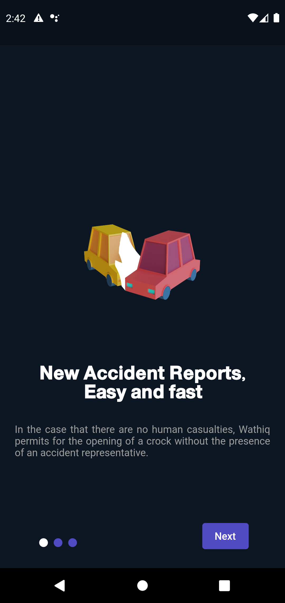
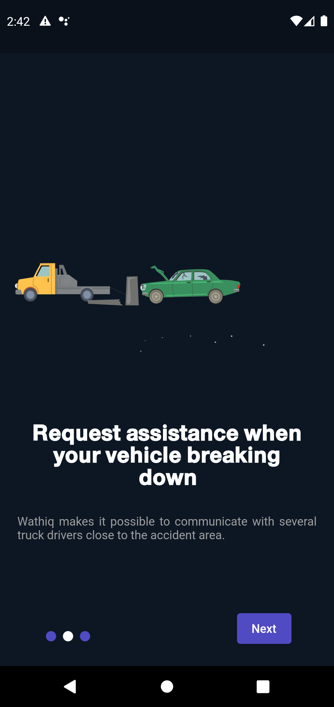
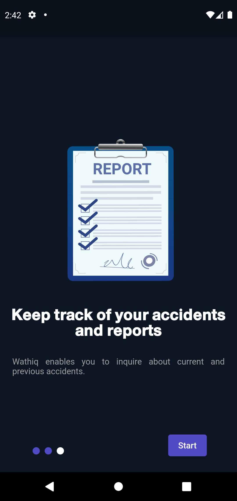
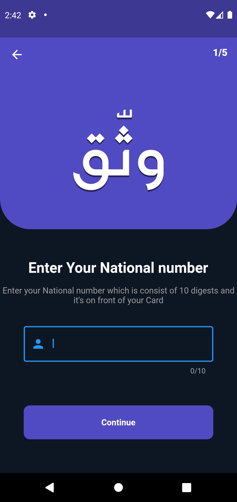
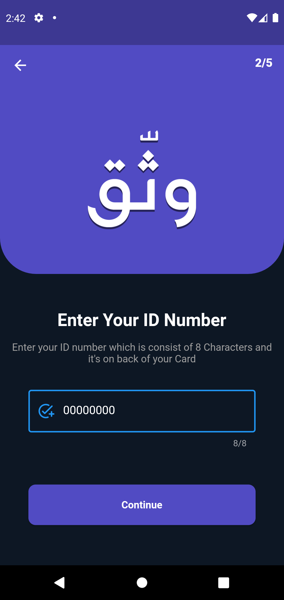
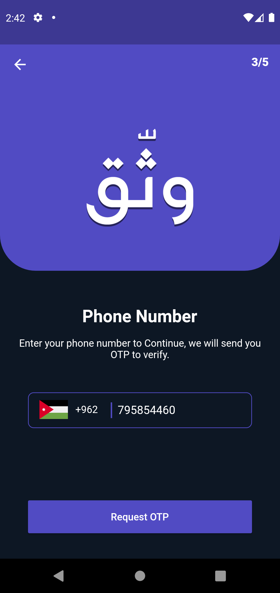
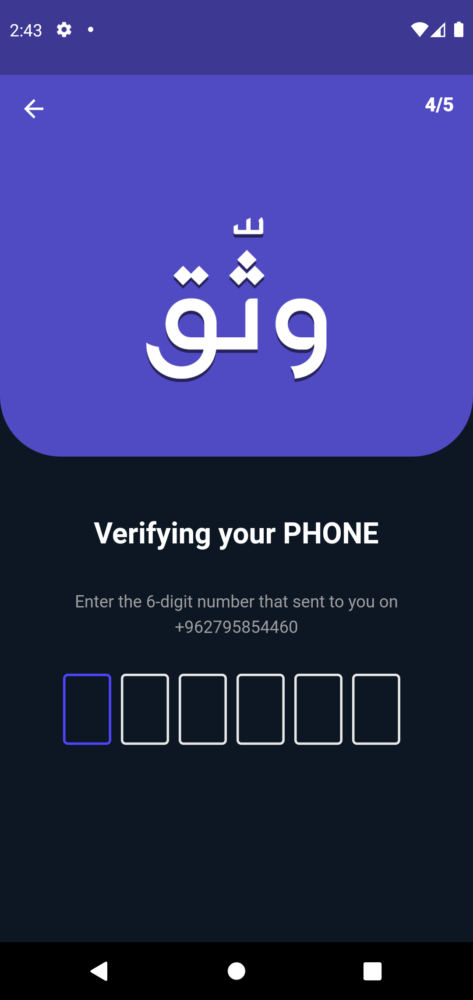
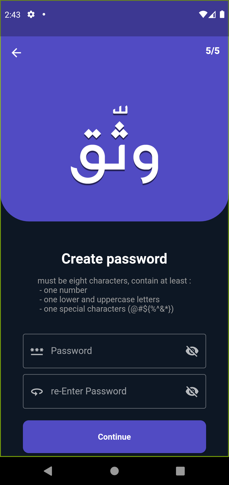

# wathiq Application

My Graduation project.

- Dart.
- Flutter
- GETX
- MVC
- Firebase

## Getting Started

Mobile application to report traffic accidents without the presence of a traffic policeman

## UI

  

 

    

